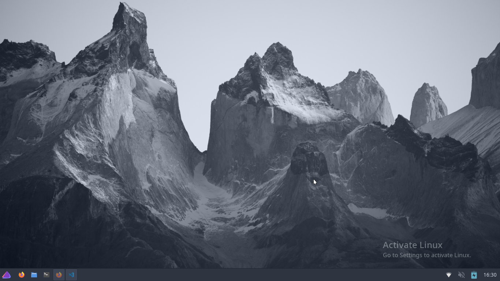

# activate-linux
[](https://www.gnu.org/licenses/gpl-3.0)

The "Activate Windows" watermark ported to Linux with cairo in C

"Science isn't about WHY. It's about WHY NOT. Why is so much of our science dangerous? Why not marry safe science if you love it so much. In fact, why not invent a special safety door that won't hit you on the butt on the way out, because you are fired." — Cave Johnson (Portal 2)

> Read [ARGS.md](ARGS.md) for information about command line arguments.

## Building

```console
make
```

> Note that the executable's name depends on the target platform


## Linux

### Dependencies

This project depends on:
- `libcairo2-dev`
- `libxi-dev`
- `libx11-dev`
- `x11proto-core-dev`
- `x11proto-dev`
- `libxt-dev`
- `libxfixes-dev`
- `libxinerama-dev`
- `libxrandr-dev`
- `libwayland-dev`

Those packages may be installed (in Debian-based distros) like this:
```console
sudo apt install libcairo2-dev libxi-dev libx11-dev x11proto-core-dev x11proto-dev libxt-dev libxfixes-dev libxinerama-dev libxrandr-dev libwayland-dev
```


### Installing

#### Ubuntu
@eddelbuettel runs a PPA with activate linux in it, so it can be installed with
```console
sudo add-apt-repository ppa:edd/misc
sudo apt update
sudo apt install activate-linux
```

#### Arch Linux
This project is in the AUR under [activate-linux-git](https://aur.archlinux.org/packages/activate-linux-git).

Install/uninstall it using your favorite AUR helper.

#### Nix (NixOS)
This repository is a flake. Run it using `nix run "github:MrGlockenspiel/activate-linux"`.

#### Gentoo
@Plexvola maintains an ebuild for activate-linux and can be installed with the following
```console
eselect repository enable vaacus
emerge --sync vaacus
emerge -av activate-linux
```

#### openSUSE / SLE
The package is built for various releases on
[OBS](https://build.opensuse.org/package/show/home:tschmitz:activate-linux/activate-linux).

Installation instructions for your specific distribution are available here:
**[https://software.opensuse.org/download.html?project=home%3Atschmitz%3Aactivate-linux&package=activate-linux](https://software.opensuse.org/download.html?project=home%3Atschmitz%3Aactivate-linux&package=activate-linux)**

Here are the Tumbleweed instructions:
```console
zypper addrepo https://download.opensuse.org/repositories/home:tschmitz:activate-linux/openSUSE_Tumbleweed/home:tschmitz:activate-linux.repo
zypper refresh
zypper install activate-linux
```

#### Fedora
The package is built for various releases on
[OBS](https://build.opensuse.org/package/show/home:tschmitz:activate-linux/activate-linux).

Installation instructions for your specific distribution are available here:
**[https://software.opensuse.org/download.html?project=home%3Atschmitz%3Aactivate-linux&package=activate-linux](https://software.opensuse.org/download.html?project=home%3Atschmitz%3Aactivate-linux&package=activate-linux)**

Here are the Fedora Rawhide instructions:
```console
dnf config-manager --add-repo https://download.opensuse.org/repositories/home:tschmitz:activate-linux/Fedora_Rawhide/home:tschmitz:activate-linux.repo
dnf install activate-linux
```

#### Other

You can use `make install` to install and `make uninstall` to remove it.

## MacOS (Horrific)

### Dependencies

Use MacPorts to install the following, then build normally.

- `xorg-server`
- `cairo`
- `xorg-libXinerama`

Alternatively, you can use [this](https://github.com/Lakr233/ActivateMac) project instead because it actually works properly

## Example:


